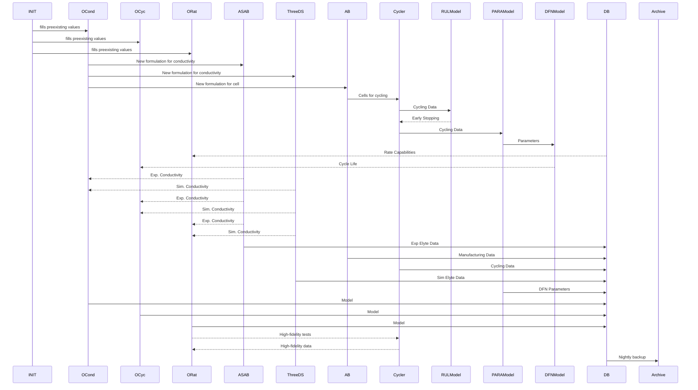
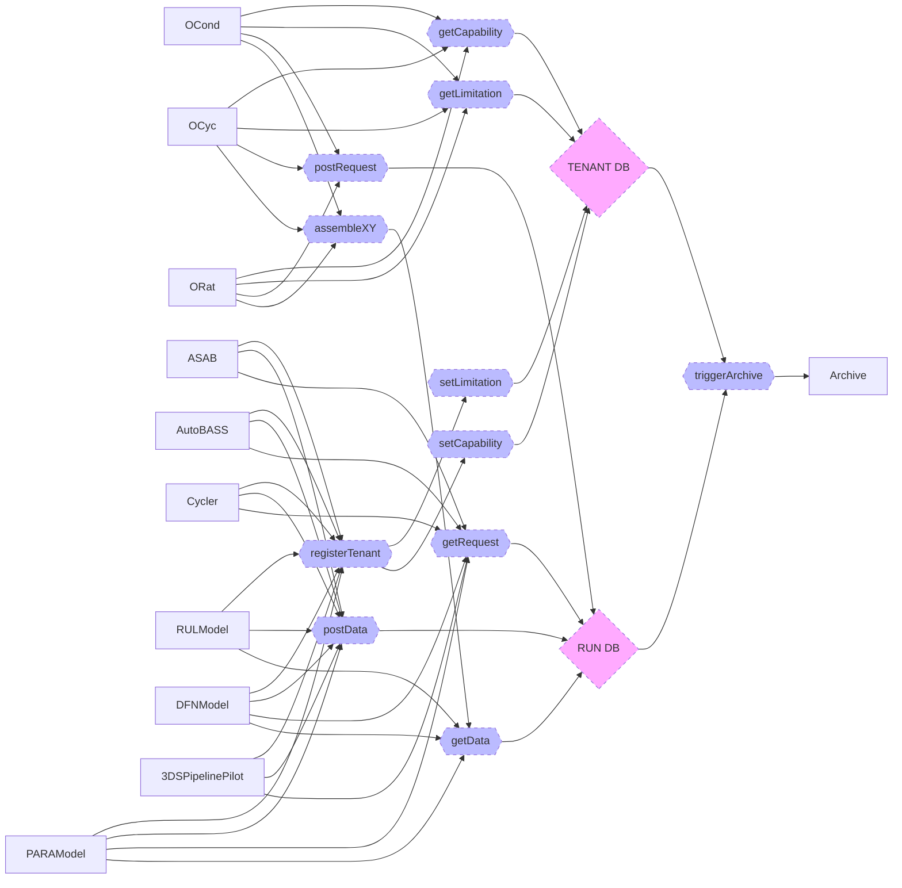

# FINALES2 Interactions

To plan the hacking week a bit better here are some data flow diagrams for conceptualization.

# DATA FLOW
Here is a rough data and materials flow diagram without finales:

# FINALES Functions

How everything interacts:

 

