# FINALES2 Interactions

To plan the hacking week a bit better here are some data flow diagrams for conceptualization.

# DATA FLOW
We have three optimization loops.

**Conductivity Optimization Loop**: This 'loop' is represented by the steps involving OCond, ASAB, and 3DSPipelinePilot. In this loop, the goal is to develop a new formulation for the electrolyte that will improve its conductivity, which is a critical property that affects the performance of the battery. The ASAB, AutoBASS, and 3DSPipelinePilot steps are used to formulate and test new electrolyte formulations, which are then used to measure and simulate conductivity. The resulting data is fed back to OCond to develop a new conductivity model for the electrolyte. The goal of this loop is to optimize the conductivity of the electrolyte using active/reinforced learning by changing the formulation in ASAB and 3DSPipelinePilot.

**Cycle Life Optimization Loop**: This 'loop' is represented by the steps involving OCyc, Cycler, and RULModel. In this loop, the goal is to optimize the cycle life of the battery by collecting and analyzing data from the Cycler. The Cycler is used to cycle the cells and collect data on their performance. This data is then used to train the RULModel to predict the remaining useful life of the battery. The OCyc step also receives input from the ASAB, AutoBASS, and 3DSPipelinePilot steps, which provide information about the electrolyte formulation and its impact on cycle life. The goal of this loop is to optimize the cycle life of the battery using active/reinforced learning by changing the formulation in AutoBASS condidering data from the conductivity optimization.

**Rate Capability Optimization Loop**: This 'loop' is represented by the steps involving ORat, AB, Cycler, PARAModel, and DFNModel. In this loop, the goal is to optimize the rate capability of the battery by formulating new electrolytes and developing new models. The AB step involves manufacturing the cells, which are then cycled using the Cycler to collect data. The data from the Cycler is used to develop parameters for the DFNModel using the PARAModel step. The ORat step then uses this information to optimize the rate capability of the battery. The ASAB, AutoBASS, and 3DSPipelinePilot steps are also used to formulate new electrolytes and test their impact on rate capability. The goal of this loop is to optimize the rate capability of the battery using active/reinforced learning taking in data from all optimization runs i.e. this is a multiproperty optimization of rate capability and cycle life.

```mermaid
sequenceDiagram
INIT ->> OCond: fills preexisting values
INIT ->> OCyc: fills preexisting values
INIT ->> ORat: fills preexisting values

OCond ->> ASAB: New formulation for conductivity
OCond ->> ThreeDS: New formulation for conductivity

OCond ->> AB: New formulation for cell
AB ->> Cycler: Cells for cycling
Cycler ->> RULModel: Cycling Data
RULModel -->> Cycler: Early Stopping
Cycler ->> PARAModel: Cycling Data
PARAModel ->> DFNModel: Parameters
DB -->> ORat: Rate Capabilities
DFNModel -->> OCyc: Cycle Life
ASAB -->> OCond: Exp. Conductivity
ThreeDS -->> OCond: Sim. Conductivity
ASAB -->> OCyc: Exp. Conductivity
ThreeDS -->> OCyc: Sim. Conductivity
ASAB -->> ORat: Exp. Conductivity
ThreeDS -->> ORat: Sim. Conductivity
ASAB ->> DB: Exp Elyte Data
AB ->> DB: Manufacturing Data
Cycler ->> DB: Cycling Data
ThreeDS ->> DB: Sim Elyte Data
PARAModel ->> DB: DFN Parameters
OCond ->> DB: Model
OCyc ->> DB: Model
ORat ->> DB: Model
ORat -->> Cycler: High-fidelity tests
Cycler -->> ORat: High-fidelity data

DB ->> Archive: Nightly backup
```

# FINALES Functions

How everything interacts:

Need the tenant specs

# FINALES2 Internals

TBD in mermaid

# FINALES2 Blocks & Interfaces

TBD in mermaid

